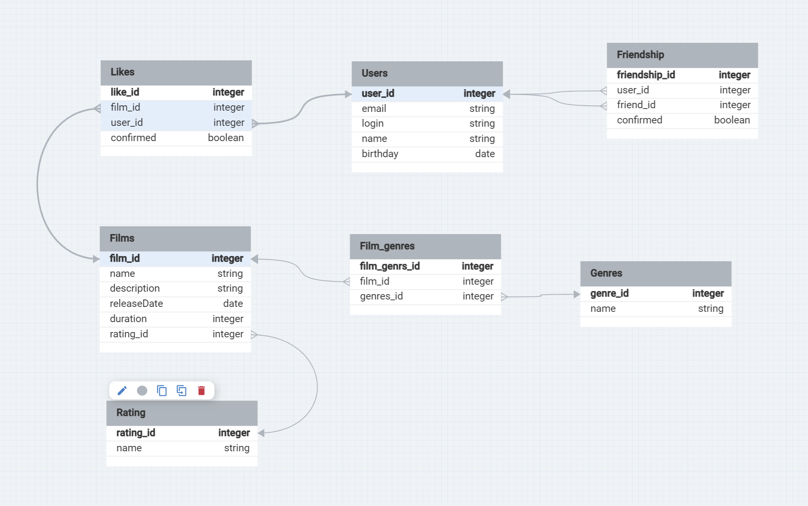

# java-filmorate

Filmorate project.

Database schema Filmorate.

Примеры запросов к БД:

Получить всех пользователей:
SELECT * FROM User

Получить пользователя по идентефикатоу
SELECT * FROM User
where user_id = N

Получить фильм по идентификатору:
SELECT * FROM Film where film_id = N

Получить первые N самых популярных фильмов
select *, COUNT(user_id) FROM Film
RIGHT JOIN Likes on (film_id = film_id)
GROUP BY film_id
order by COUNT(user_id) desc
limit N 