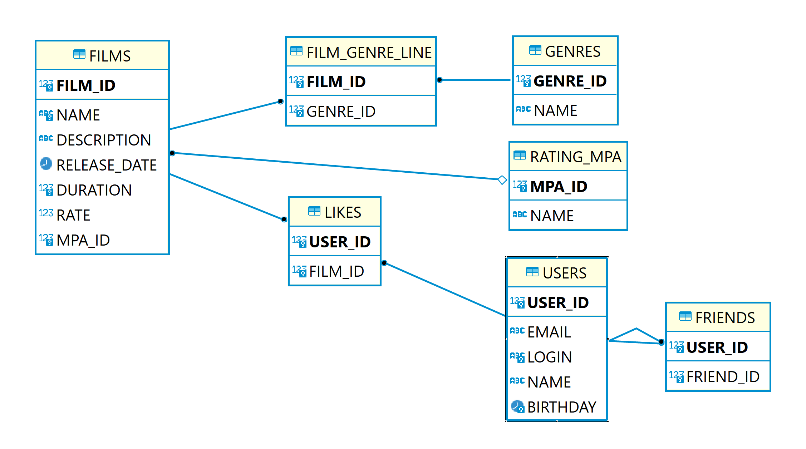

# java-filmorate

Filmorate project.

Database schema Filmorate.

Примеры запросов к БД:

Получить всех пользователей:
SELECT * FROM Users

Получить пользователя по идентификатору
SELECT * FROM Users
where user_id = N

Получить фильм по идентификатору:
SELECT * FROM Films where film_id = N

Получить первые N самых популярных фильмов
SELECT *, COUNT(user_id) FROM Films
RIGHT JOIN Likes on (Likes.film_id = Films.film_id)
GROUP BY film_id
ORDER BY COUNT(user_id) desc
LIMIT N 